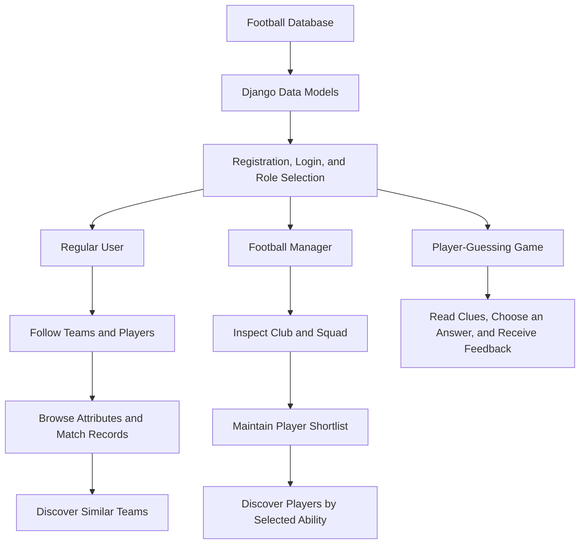

# Football Data Insight Platform

A football information platform built with **Django, SQLite, and Bootstrap**, bringing team and player browsing, follow management, personalized recommendations, and an interactive guessing game to football fans and managers.

## Background

Football data spans leagues, teams, players, and matches. Fans need a convenient way to keep track of their interests, while football managers need to inspect squads, compare player attributes, and maintain a shortlist of potential recruits.

This project brings these needs into one web application, using separate role-based interfaces and attribute-based recommendations to connect information browsing with the discovery of new teams and players.

## Methodology and Workflow

### 1. Data organization and architecture

SQLite stores countries, leagues, teams, players, matches, and their attribute records. Django ORM maps the existing database tables, while additional tables represent accounts, team subscriptions, player follows, manager employment, and recruitment interests.

Django handles routing, queries, and application logic. Django templates and Bootstrap present the information through tables, forms, and feature cards.

### 2. Two user roles

| Role | Main features |
|---|---|
| Regular user | Browse teams and players by league, manage follows, inspect attributes and related match records, discover similar teams, and play the player-guessing game. |
| Football manager | Inspect an assigned club and its squad, browse player attributes, maintain a shortlist, and discover candidates based on a selected ability. |

Follow and shortlist records organize each user's information pages and provide the input for recommendations.

### 3. Team recommendations through tactical similarity

Each team attribute record is represented by seven numerical features: **build-up play speed, build-up play passing, chance creation passing, chance creation shooting, defensive pressure, defensive aggression, and defensive team width**.

The system averages the attribute records associated with followed teams to obtain a user preference vector:

$$
\mathbf{v}=\frac{1}{N}\sum_{i=1}^{N}\mathbf{x}_i
$$

It then calculates the Euclidean distance between this vector and each candidate attribute vector from unfollowed teams:

$$
d(\mathbf{v},\mathbf{x})=\sqrt{\sum_{j=1}^{7}(v_j-x_j)^2}
$$

Smaller distances indicate more similar tactical attributes. The system selects the **10 closest candidate attribute records** and displays the corresponding teams, which the user can follow.

The current implementation scores individual attribute records. If a team has records from multiple dates, the results do not necessarily represent 10 distinct teams.

### 4. Player recommendations based on ability preferences

Managers select an attribute such as overall rating, potential, finishing, passing, or speed. The system calculates the mean of the valid values in attribute records associated with shortlisted players, then uses a **mean ±5** interval to filter candidates while excluding players already on the shortlist.

This module uses a single-attribute range-matching rule to support exploration around a specific ability preference.

### 5. Interactive player-guessing game

The game randomly selects a player attribute record and presents clues such as rating, potential, preferred foot, birthday, height, and weight. The correct name is mixed with distractor names to create the answer options.

The implementation uses `values()` to retrieve the required fields, `distinct()` to remove duplicate names, and a pool of at most 50 names for sampling distractors.



## Results

The repository implements interfaces for both roles, bringing football data queries, personal follow management, attribute-based recommendations, and an interactive game into one platform.

The bundled database contains:

| Data category | Records |
|---|---:|
| Countries / leagues | 11 / 11 |
| Teams | 299 |
| Players | 11,060 |
| Team attribute records | 1,458 |
| Player attribute records | 183,978 |
| Match records | 50,000 |

These figures are row counts from the database supplied with the repository; they do not establish the number of deduplicated or independently verified real-world matches. The project currently demonstrates application features and data interaction. No quantitative evaluation of recommendation accuracy, user satisfaction, or response time is included.

## Project Files

```text
Football-Data-Insight-Platform/
├── README.md
├── LICENSE
└── soccer_project/
    ├── manage.py
    ├── soccer.db.zip
    ├── soccer_project/
    │   ├── settings.py
    │   ├── urls.py
    │   ├── asgi.py
    │   └── wsgi.py
    └── soccer_app/
        ├── models.py
        ├── views.py
        ├── urls.py
        ├── templates/
        ├── migrations/
        └── tests.py
```

Paths below are relative to the outer `soccer_project/` directory.

| File or directory | Purpose |
|---|---|
| `manage.py` | Entry point for Django management commands. |
| `soccer.db.zip` | Bundled SQLite database; the extracted `soccer.db` is the database file referenced by the project configuration. |
| `soccer_project/settings.py` | Configures the database, applications, templates, and authentication model. |
| `soccer_project/urls.py` | Defines project-level routing. |
| `soccer_app/models.py` | Maps football data, accounts, follow relationships, and manager-related records. The main models use `managed = False` to work with existing tables. |
| `soccer_app/views.py` | Implements registration and login, data queries, follow management, recommendations, and the guessing game. |
| `soccer_app/urls.py` | Maps feature pages and actions to views. |
| `soccer_app/templates/` | Contains user and manager dashboards, recommendation pages, and game templates. |
| `soccer_app/migrations/` | Stores the existing database migration declarations. |
| `soccer_app/tests.py` | Placeholder for application tests; no test cases have been added yet. |

## License

Distributed under the [MIT License](LICENSE).

Developed by **Group 18**: Zhang Junwei, Cao Yunhe, and Yang Xi (Phil-1030).
